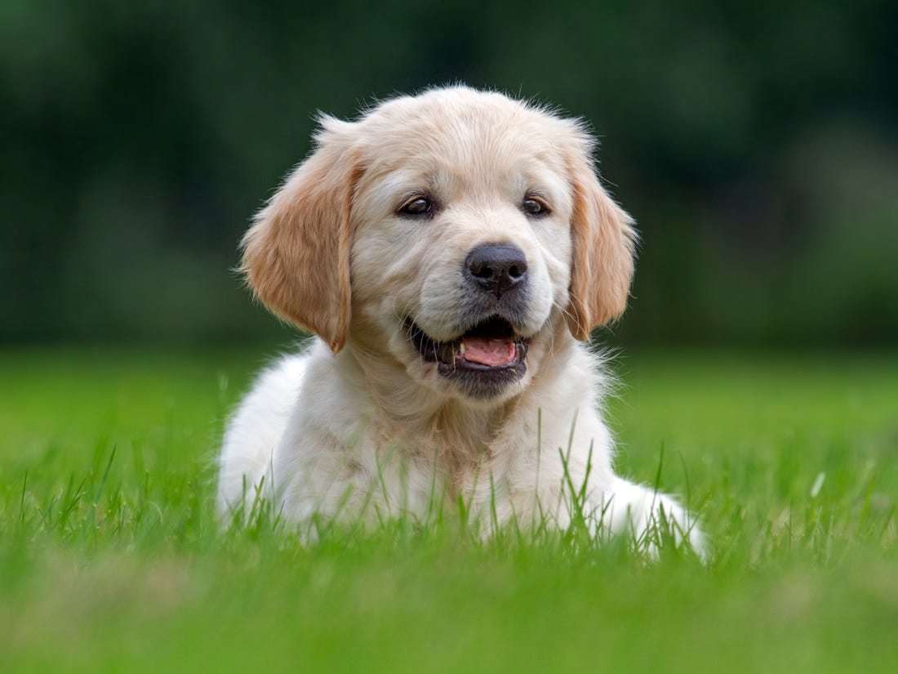

# 🐾 Cats vs Dogs Image Classifier

A Convolutional Neural Network (CNN) built from scratch using PyTorch to classify images of cats and dogs.

## Results
- **Training images:** 20,000
- **Test images:** 5,000
- **Final Accuracy:** 83.94%
- **Loss after 5 epochs:** 0.28

## Model Architecture
- Input (3, 64, 64)
→ Conv2d(3, 32) + ReLU + MaxPool
→ Conv2d(32, 64) + ReLU + MaxPool
→ Conv2d(64, 128) + ReLU + MaxPool
→ Flatten
→ Linear(12866, 2)
→ Output: Cat or Dog

## Tech Stack
- Python
- PyTorch
- Torchvision
- PIL

## Dataset
Microsoft Cats vs Dogs Dataset — 25,000 images
https://www.kaggle.com/datasets/shaunthesheep/microsoft-catsvsdogs-dataset

## How to Run

### Install dependencies
```bash
pip install torch torchvision pillow
```

### Train the model
```bash
python train.py
```

### Predict on your own image
```python
predict("your_image.jpg")
```

## Sample Prediction


## Project Structure

Project_CatsVsDogs/
├── model.py        # CNN architecture
├── train.py        # training + evaluation
├── catdog_model.pth # saved model weights
└── README.md